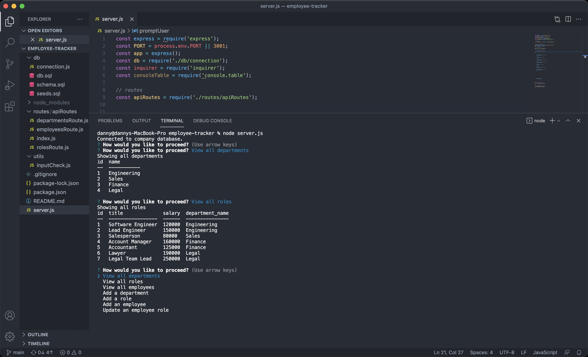

# Employee Database Tracker

## About this program

Employee Database Tracker allows the user to explore the database of a specific company and view its departments, roles, and employee information concerning their roles within the company. The user can also modify this database.

(LINK TO VIDEO IN MEDIA FOLDER)

## Installation
npm install package

## Contributing
Hector Perez

## Built with

* Javascript
* node.js
* express.js
* mysql
* npm packages

### Questions
Contact me:

[Github](https://www.github.com/hpere102)  
[Email](mailto:hpere102@fiu.edu)
